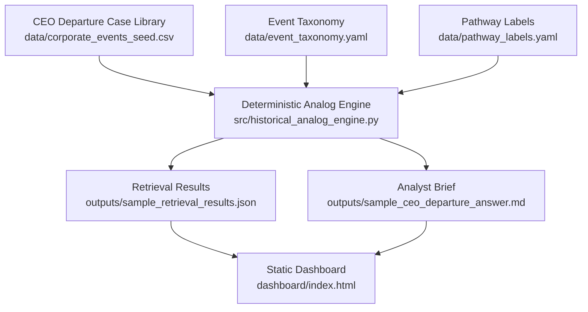

<<<<<<< HEAD
# Corporate Event Intelligence Engine

Evidence-based historical analog retrieval and analyst-style synthesis for corporate events.

This repository is a portfolio-ready analytics product demo focused on CEO departure events. It uses a curated historical case library, deterministic retrieval logic, pathway aggregation, and a static dashboard to show how corporate event intelligence can be structured without forecasting, stock prediction, or investment recommendations.

## Product Boundary

- Historical analogs only
- Descriptive analysis only
- No forecasts
- No stock prediction
- No investment advice
- No LLM APIs
- No new event categories in the current demo

## Current Demo Question

> What usually happens after an abrupt CEO departure?

The demo retrieves comparable CEO departure cases, explains why they were selected, aggregates observed pathways, links the evidence base, and renders an analyst-style brief.

## Architecture



## Repository Structure

```text
data/
  corporate_events_seed.csv
  event_taxonomy.yaml
  pathway_labels.yaml
docs/
  product_brief.md
  mvp_architecture.md
  historical_analog_engine_design.md
  retrieval_scoring_framework.md
  sprint2_implementation_plan.md
outputs/
  sample_retrieval_results.json
  sample_ceo_departure_answer.md
src/
  historical_analog_engine.py
dashboard/
  index.html
  styles.css
  app.js
```

## Demo Workflow

Regenerate the deterministic retrieval outputs:

```bash
python3 src/historical_analog_engine.py
```

Validate the engine:

```bash
python3 -m py_compile src/historical_analog_engine.py
```

Serve the dashboard from the repository root:

```bash
python3 -m http.server 8000
```

Open:

```text
http://localhost:8000/dashboard/
```

## Dashboard Screenshot

Placeholder:

```text
docs/assets/dashboard-screenshot-placeholder.svg
```

Add a screenshot after opening the local dashboard and confirming the JSON and analyst brief render correctly.

## Retrieval Logic

The historical analog engine scores cases using:

- `departure_type`
- `sector`
- `context`
- `observed_pathway`

For the current demo question, sector is neutral because the question does not specify an industry constraint. The output is deterministic: the same case library and query profile produce the same retrieval JSON and analyst brief.

## Validation Checklist

- Run `python3 src/historical_analog_engine.py`
- Run `python3 -m py_compile src/historical_analog_engine.py`
- Serve the dashboard locally from the repository root
- Confirm `outputs/sample_retrieval_results.json` renders in the dashboard
- Confirm `outputs/sample_ceo_departure_answer.md` renders in the dashboard
- Confirm browser console has no errors
- Confirm README links point to existing repository files

## Limitations

This product summarizes historical cases and observed pathways. It does not predict future outcomes, recommend investments, issue ratings, or produce price targets.
=======
# corporate_event_intelligence_engine
Evidence-based corporate event intelligence engine using historical analogs, observed pathways, and analyst-style synthesis.
>>>>>>> c9ae978f832fb8f5da2e47904edf11411c3cb734
